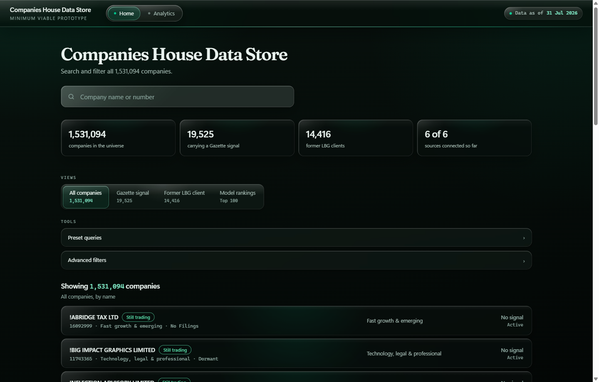
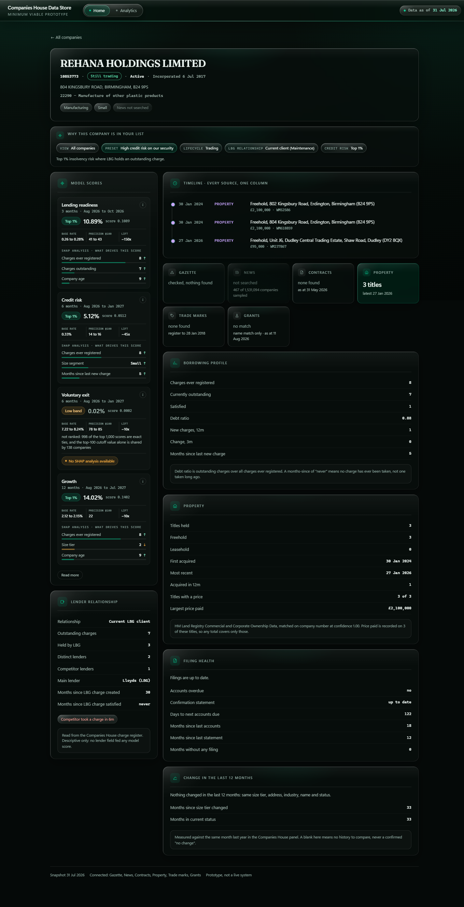
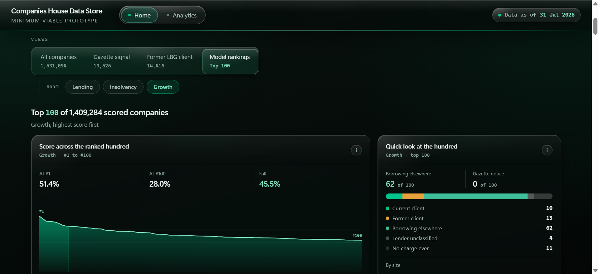
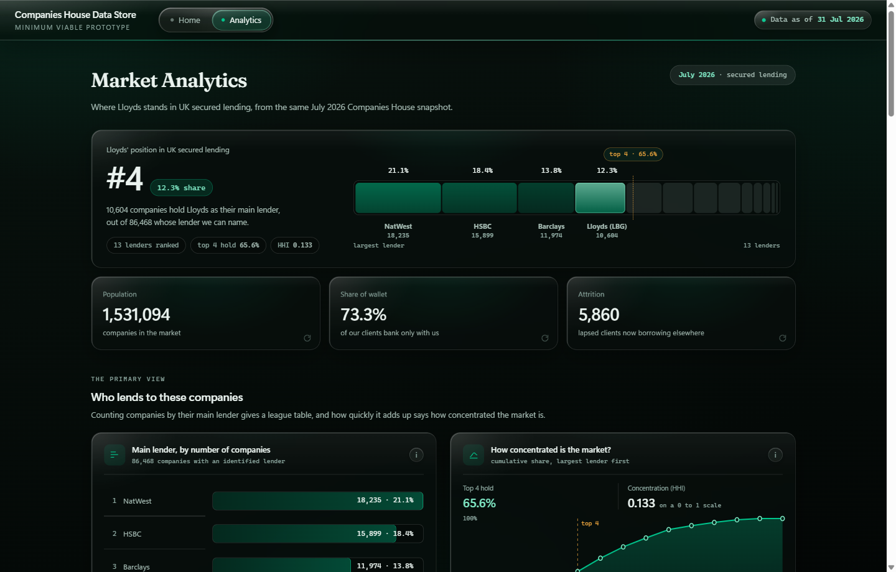

# Lloyds Commercial Banking Intelligence

**Can the public record alone tell a commercial bank which companies are about to need it?**

A pipeline that mines only free public data, Companies House and six other public
sources, to rank UK companies by their likely need for commercial banking services,
including companies that do not bank with Lloyds today. Every score arrives with the
reasons behind it, and the whole thing is delivered as a dashboard a relationship
manager can work.

No internal bank data was used, or available, at any point.

MSc Data Science group project, University of Bristol, 2026.
Samuel Menon Demelo, Sneha Saphala Ram Prasad, Viktor Anders Lindholm, Vishal Khatri.



---

## The research question

> Can the public record of structured and unstructured data sources alone, with no
> access to internal bank data, be mined to rank companies in these sectors by their
> likely need for commercial banking services, including companies the bank does not
> currently serve, and can each ranking be explained well enough to act on?

A bank sees its own customers completely and everyone else barely at all. Of the
5.7 million companies on the UK register, the ones worth approaching are mostly
invisible to it. That makes this a **search problem over a sparse population**, not a
classification problem over a known book, which is why we rank rather than classify
and report precision at the top of the list rather than accuracy.

Scoped to three sectors (Technology/legal/professional, Manufacturing, Fast-growth
and emerging), which is 1.5 million companies. Scoped by sector but **not** by size,
so the signal separating small firms from large stays available to the model; SME
focus is applied as a filter at the point of use.

## What we built

**Four models, each predicting a different commercial question.** LightGBM, trained on
33 monthly snapshots of the register (Oct 2023 to Jul 2026), features from month `t`
and labels strictly from `t+1` onward, scored for the 1,409,284 active companies.

| Score | Horizon | Predicts | Right in top 100 | Base rate | Lift |
|---|---|---|---|---|---|
| **Lending readiness** | 3 months | Registers a new secured charge | 41–43 | 0.26% | **~150x** |
| **Credit risk** | 6 months | Hits a genuine insolvency event | 14–16 | 0.33% | ~45x |
| **Growth** | 12 months | Moves up a size tier | 22 | 2.1% | ~10x |
| **Voluntary exit** | 6 months | A strike-off proposal is filed | 78–85 | 7.2–8.2% | ~10x |

**Read the lift, not the hit rate.** Voluntary exit looks like the best of the four and
is the weakest: about one company in twelve files for strike-off anyway. Lending
readiness at 41 in 100, against an event that happens to one company in 400, is the
strong result. Voluntary exit also ships unranked, because 998 of its top 1,000 scores
are exact ties and a numbered list would invent an order the data does not have.

**A dashboard over 1,531,094 companies.** Flask and DuckDB querying a Parquet file in
place, with a dependency-free vanilla-JS front end. Nothing is precomputed, so every
count on screen is measured at runtime and the dashboard cannot disagree with the
data, because there is no second copy to disagree with. 27 filters, nine presets, six
public sources joined onto one spine, and per-company SHAP reasons.

| | |
|---|---|
|  |  |
| A company profile: scores, lender relationship, and one cross-source timeline | The top 100 on each model, with the score decay curve |



## The contribution: six measured negatives

Most projects report what worked. The distinguishing result here is a set of
properly measured answers to questions the brief actually asked, each with a date and
a receipt. They are the reason the architecture is structured-first.

| | Finding | Evidence |
|---|---|---|
| **N1** | Narrative media does not reach SMEs | 2.8–6.9% raw hit rates across NewsAPI, Guardian and GNews; **0 of 467 companies verified** after disambiguation. A Tesco control returns 1,209 articles, so the tooling works |
| **N2** | Market-identifier data does not reach SMEs | 0.10% LEI coverage, **0.00% ticker**, across 869,043 companies. Corrected down from an initially reported 9.14%, which was an orphan-join artefact |
| **N3** | Losing a bank does not predict distress | 7.2% of firms that later hit distress had lost a bank in the prior 24 months, against a 5.5% baseline. Coincident, not predictive |
| **N4** | Lender identity adds nothing a boosted model cannot already read | At the most conservative visibility gate LightGBM gains nothing; any apparent gain scales monotonically with how loose the gate is |
| **N5** | Statutory sources reach SMEs, but only after the fact | The Gazette covers 106,664 companies, of which only **1,033 (0.075%)** are inside the active universe |
| **N6** | Statutory reach is source-specific, not uniform | Three other public packs reach 78,782 companies (5.27%) against the Gazette's 1.33%. Land Registry alone reaches 60,629 on an exact company-number match |

The sharpest way to put N1 and N5 together is **narrative against statutory**:
journalism ignores small companies entirely, while statutory registers cover them
completely but only once something has already gone wrong. That explains every
coverage number in the project.

One line explains the whole source table: **if a source prints the company number, it
works; if it prints only a name, it does not.**

## Running it

Three commands from a cold clone. The dashboard runs entirely locally and makes no
outbound network calls.

```bash
git clone https://github.com/Viklin41/lloyds-commercial-banking-intelligence-2026.git
cd lloyds-commercial-banking-intelligence-2026

pip install -r requirements.txt          # or just: pip install Flask duckdb pandas
python scripts/fetch_dashboard_data.py   # 217 MB, published as a release asset
python dashboard/serve.py                # opens http://127.0.0.1:8000
```

The data is not in git: it is 217 MB across 15 files, so it ships as a release asset
and `fetch_dashboard_data.py` unpacks it into `data/` in the layout the server
expects. If you already have `Data_Dashboard.zip`, pass `--zip PATH` to skip the
download. `serve.py` resolves its data tree from `--data`, then `LLOYDS_DATA`, then
`data/` beside the repo, and tells you exactly what it looked for if it cannot find
it.

Useful flags: `--port 8080`, `--no-browser`, `--data DIR`.

**Companies worth typing into the search box.** `CUBICLE WASHROOM SYSTEMS LIMITED`
(09919041) is the whole story on one page: a small Hampshire manufacturer, former
Lloyds client who left for NatWest, a rival took a charge within six months, and it
won its first public contract. `PARK CAKES LIMITED` (05998327) populates nearly every
panel at once. `!NFOGENIE LTD` (13522064) shows how absence is reported.
`dashboard/dashboard_manual.md` §9 has the full demo list.

**Rebuilding from scratch** rather than from the shipped data means running the
notebooks in order; `notebooks/01_base/01_companies_house.ipynb` fetches the ~470 MB
Companies House bulk product itself. The API notebooks need your own keys in a `.env`
file. Expect the lender charge harvest alone to take about 25 hours.

## What is in here

```
notebooks/            41 notebooks, grouped by workstream rather than renumbered,
  01_base/            because the numbers are referenced inside the notebooks and
  02_unstructured/    the report. Base register, the news lab, the alternative
  03_registers/       registers, existing-relationship work, the modelling core,
  04_relationships/   the dashboard's data prep, and the market analysis.
  05_modelling/
  06_dashboard/
  07_market/
src/                  The pipeline as importable modules: bulk download, static and
                      API features, the panel, contracts, matching, charges, the
                      lender dictionary, targets, training, and LaTeX reporting.
scripts/              Figure and table generators, run drivers, the data fetcher.
dashboard/            serve.py, index.html, the manual, handbook, design document
                      and FILTER_SPEC. This is the deliverable.
reports/runs/         Eleven recorded runs: manifest, metrics and SHAP importances
                      for each. `refactor_growthfix` produced the shipped shortlists.
reports/shortlists/   Top 100 per target for July 2026, with a reason string each.
reports/tables/       Every table in the report, as CSV and as LaTeX.
reports/figures/      Every figure, regenerable by script without opening a notebook.
latex-report/         The report source, bibliography and images.
docs/                 The project chronology (what was done, when, and why it
                      stopped) and the dashboard architecture deep-dive.
```

**Feature branches are kept, not deleted.** The report and the chronology cite work by
branch, and each branch is the immutable record of one workstream. `main` is the
assembled, runnable version.

## Honest limitations

- **A registered charge is a proxy for a banking relationship, not the relationship.**
  It says nothing about current accounts, deposits or unsecured lending.
- **The lending model largely finds companies that already borrow heavily.** That is a
  real property of the model, not a bug, and the top-ranked company is itself a
  bridging lender whose charges are its loan book.
- **The growth model leans on current size,** because the target is moving up a size
  tier, and nine of its features were found to be 100% NULL in every training origin.
  It runs on 27 features rather than the 41 it was labelled for.
- **Vintages differ and are printed next to every number.** The register is July 2026,
  contracts 31 May 2026, property 29 June 2026, and the IPO trade mark register stops
  at **28 January 2018**, which is a property of the source, not of our collection.
- **The scores rank well but are not deployment-calibrated.** Read the band, not the
  digits, at the very top of the range.
- **Four universe counts appear in this project** (869,043 spine, 1,372,321 feature
  matrix, 2,038,130 panel, 1,531,094 handover). They are nested rather than
  contradictory, but any figure must name which one it is out of.

## Read more

- `latex-report/` — the full report: method, evaluation across eleven runs, the
  leakage defect and its repair, global SHAP, and the market analysis.
- `docs/project-chronology.md` — every workstream, what it found, and why it stopped
  or was superseded. This is the document that makes the build retraceable.
- `docs/dashboard-architecture.md` — how the dashboard fetches, filters and renders.
- `dashboard/dashboard_manual.md` — a fifteen-minute plain-language guide.
- `dashboard/FILTER_SPEC.md` — every filter, its exact SQL, and how it was verified.

Data sources, all free and public: Companies House (bulk product and REST API), The
Gazette, Contracts Finder and Find a Tender, HM Land Registry CCOD, the Intellectual
Property Office, UKRI Gateway to Research, and the Guardian Open Platform.
