# Companies House Data Store handbook

This is the walkthrough I would give you if we were sitting at the same screen. It covers what the
dashboard is for, what every control does, and what the numbers on it actually mean. It is not about
how the thing is built.

The short version of what it does  is: it holds **1,531,094 active UK companies** from the July 2026
Companies House snapshot, joins six external sources onto them, and gives you two ways in. You either
**start from a question** ("who has borrowed before, cleared it, and has nobody holding security
today?") and get a list, or you **start from a company** and get everything we know about it on one
page. There is also an Analytics page that steps back and describes the whole market rather than any
one company.

One thing to be clear about from the start, because it changes how you should read everything below.
This tells you what companies are *doing*: taking on secured borrowing, falling behind on filings,
losing a lender, winning public work. It does **not** tell you which Lloyds product to sell them. That
step is yours. Nothing in here maps a company to a facility, and where I use words like "prospect" I
mean a company worth a conversation, not a company the model says will buy something.

---

## Getting it running

The dashboard is a single page served by a small local query server. From the repository root:

```
python dashboard/serve.py
```

It opens a browser at `http://127.0.0.1:8000` on its own. Add `--no-browser` if you would rather open
it yourself.

**If you are working inside Claude Code**, prefix the command with `!` so it runs in your own shell
rather than the assistant's, and give the full paths:

```
! <path-to-python>\python.exe <path-to-repo>\dashboard\serve.py --no-browser
```

Use the Python that has `duckdb`, `flask` and `pandas` installed, which on most of our machines is the
Anaconda one rather than the default. Then open `http://127.0.0.1:8000` yourself.

Either way it takes fifteen seconds or so to start, because it loads the company file and six side
tables into memory before it answers anything, and it prints what it found while it does:

```
data    : <your data folder>
parquet : ...\dashboard_bulk_gazette_2026-07.parquet
universe: 1,531,094 companies queryable
loading side tables ...
serving : http://127.0.0.1:8000   (Ctrl+C to stop)
```

If the data lives somewhere else on your machine, point it there with `--data <folder>` or by setting
`LLOYDS_DATA`. If it cannot find the file it will tell you exactly what it was looking for rather than
failing with a stack trace.

A short branded clip plays while the page loads. It lifts on its own after about four seconds, or you
can click anywhere or press Escape to skip it. You will see it again on a refresh but not when moving
between Home and Analytics.

---

## How the dashboard is laid out

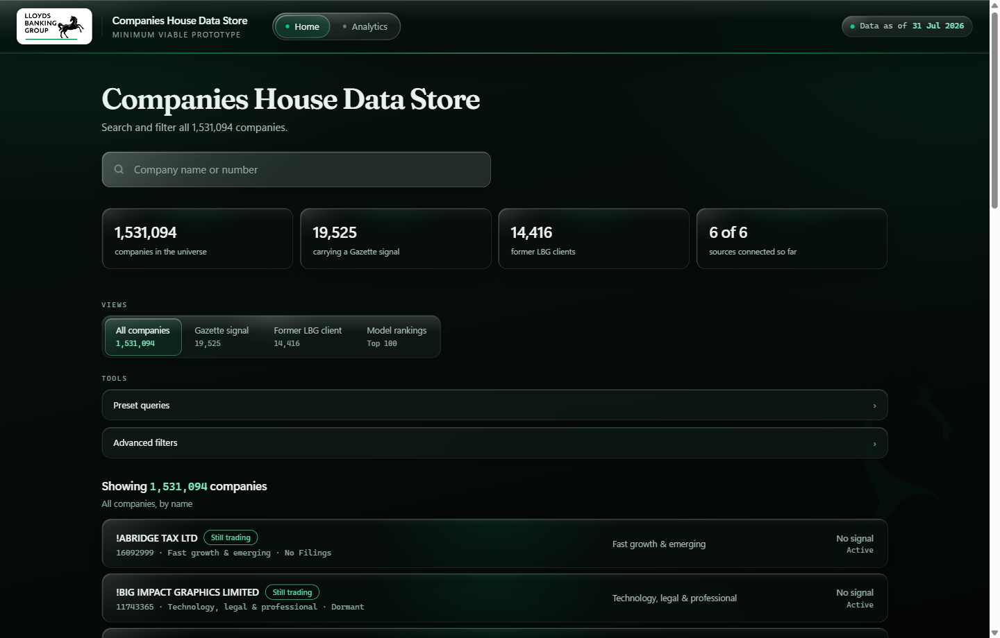

Everything on Home reads top to bottom in the order you would use it.

The **four numbers** across the top are the scale you are working at. 1,531,094 companies in the file,
19,525 carrying a Gazette signal, 14,416 former Lloyds clients, six of six sources connected.

**Views** are the four starting points. The first three are populations, not filters: three different
questions, each sorted on something different. The fourth is a ranking rather than a population, and it
behaves differently, which is why it has its own section further down.

| View | What it is | Sorted by |
|---|---|---|
| All companies | Everything, 1,531,094 | Company name |
| Gazette signal | The 19,525 with an insolvency notice against them | Furthest through the distress ladder, most recent first |
| Former LBG client | The 14,416 who held secured lending with us and no longer do | Most recently lapsed first |
| Model rankings | The top 100 on one model | That model's score, highest first |

Pick a view first, then narrow it. Filters always apply *inside* whichever view is selected, so
"Gazette signal" plus a Manufacturing filter gives you distressed manufacturers, not all manufacturers.
Model rankings is the exception: it is a fixed hundred, so the filters and presets are hidden while you
are in it. Narrowing a ranking would leave you with a list that is no longer the top hundred of
anything.

**Tools** holds the two ways of narrowing: Preset queries and Advanced filters. Both are drawers, both
start closed, and both stay where you left them.

Underneath is the count line, which always tells you two numbers once you have filtered anything:
`Showing 2,303 of 1,531,094 companies`. The **Clear all** button next to it puts you back to the full
population.

---

## Looking up one company

The search box takes a **name or a company number** and matches on both. Type `TESCO` and you get the
Tesco companies. Type `12723324` and you get that exact company. Partial names work, so `PRINTER
SPECIAL` will find the printer specialists.

This is the right way in when you already have a company in mind: a name from a call, a number off a
credit paper, a business you drove past. For everything else, start from a question instead.

---

## Quick queries: the nine presets

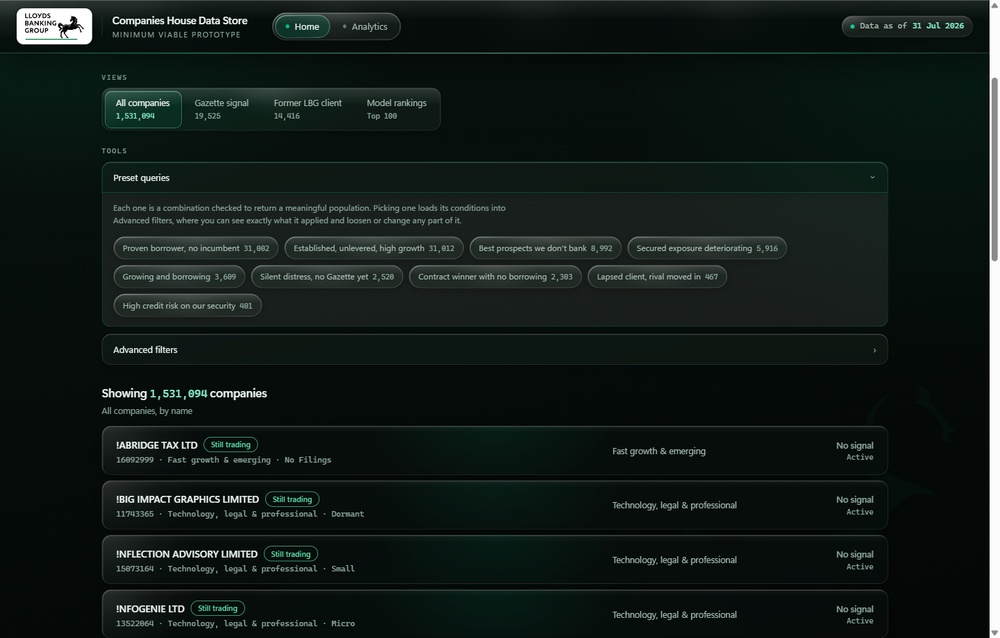

These are the fastest thing in the dashboard and the place I would start. Each one is a combination
that has been checked to return a population worth looking at, and each answers a commercial question
you would recognise.

| Preset | Companies | What it means |
|---|---|---|
| Proven borrower, no incumbent | 31,002 | Borrowed before and cleared it. No incumbent to displace. |
| Established, unlevered, high growth | 31,012 | Five years trading, never borrowed, top 10% growth. |
| Best prospects we don't bank | 8,992 | Top 1% for new borrowing, never an LBG client. |
| Secured exposure deteriorating | 5,916 | Security is held and the company has stopped filing on time. |
| Growing and borrowing | 3,609 | Expanding and actively taking on secured debt. |
| Silent distress, no Gazette yet | 2,520 | Both filing signals failed, nothing has reached the Gazette. |
| Contract winner with no borrowing | 2,303 | Just won public work, never borrowed. Delivery needs working capital. |
| Lapsed client, rival moved in | 467 | Left us, and a competitor took a charge within 6 months. |
| High credit risk on our security | 401 | Top 1% insolvency risk where LBG holds an outstanding charge. |

Click one and the list rebuilds. Click the same one again and it comes off. Only one preset is active
at a time, so picking a second replaces the first rather than stacking.

**The part worth knowing:** picking a preset does not just filter the list, it **loads its conditions
into Advanced filters**. Open the filter drawer after applying one and you will see exactly which boxes
it ticked. That means you can take a preset as a starting point and then loosen or tighten any part of
it, which is usually more useful than either the preset or a blank filter panel on its own.

Eight of the nine work that way. **Contract winner with no borrowing** is the exception: one of its
conditions, "won a public contract in the last 12 months", has no matching control in the filter panel,
so that preset cannot be unpacked and edited. The dashboard says so rather than pretending, and lists
its four conditions in plain text instead.

---

## Advanced filters

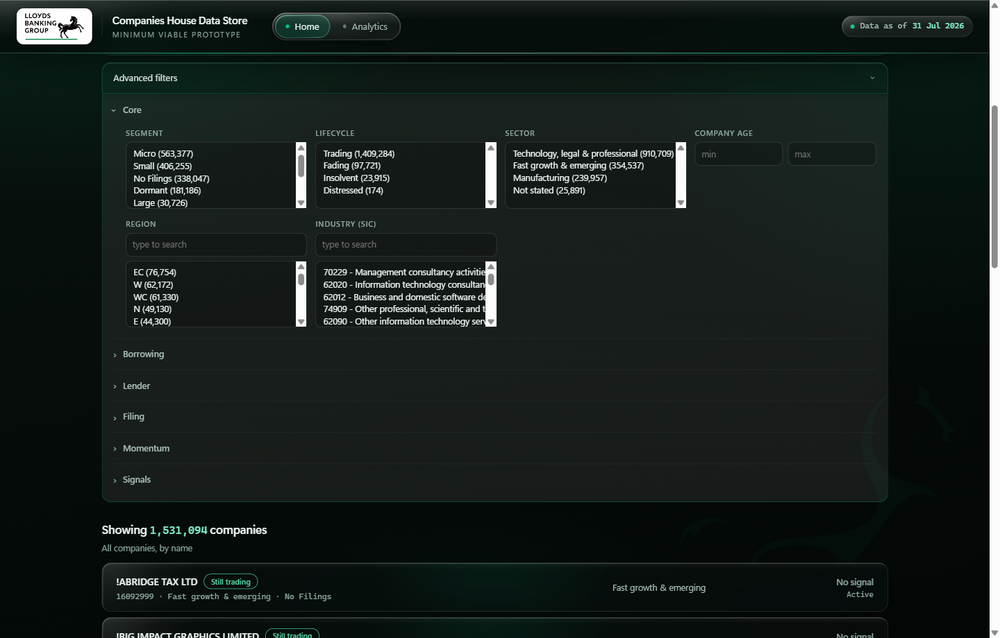

Twenty-seven filters in six groups. Every option carries its own count, so you can see how much a
choice will cost you before you make it. Groups start collapsed apart from Core.

**Core** is who the company is. Segment (Micro 563,377, Small 406,255, No Filings 338,047, Dormant
181,186, Large 30,726, and so on), Sector, Company age, Region by postcode area, and Industry by SIC
code with a search box because there are hundreds of them.

**Lifecycle** sits in Core and is worth understanding properly, because it is not the same as the raw
Companies House status. It collapses that status into four states you can act on:

| Lifecycle | Companies | Underlying status |
|---|---|---|
| Trading | 1,409,284 | Active |
| Fading | 97,721 | Active, proposal to strike off |
| Distressed | 174 | Receiver on a charge, or a voluntary arrangement |
| Insolvent | 23,915 | Administration, receivership or liquidation |

**Borrowing** is the charge register. *Ever borrowed* is whether a charge was ever registered.
*Outstanding mortgages* is how many are live now. *Repayment state* splits into fully repaid, partly
repaid and all outstanding. *New charge in 12m* is recent borrowing activity.

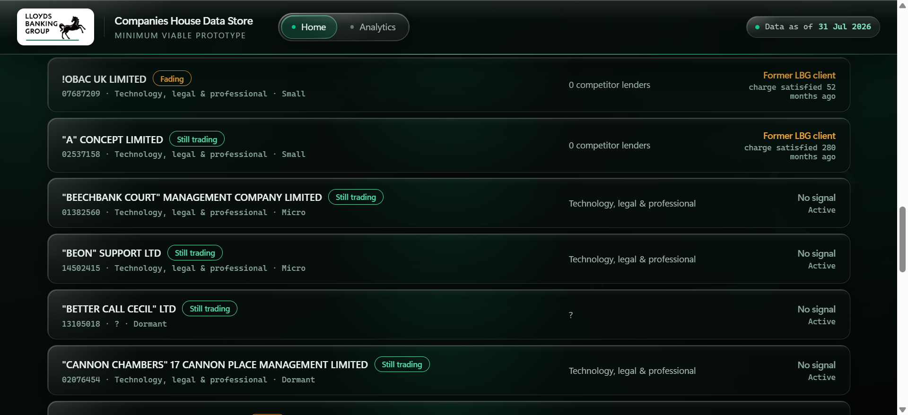

**Lender** is who they bank with. *LBG relationship* is the big one, and it now has **five** options
rather than three, because "never a client" was hiding three quite different populations inside one
number:

| Option | Companies | What it means |
|---|---|---|
| Current client (Maintenance) | 11,733 | We hold a live charge |
| Former client (Attrition) | 14,416 | We held one and no longer do |
| Borrowing elsewhere (Growth) | 68,861 | They borrow, from someone else, never from us |
| Charge held, lender unclassified | 16,257 | A live charge whose lender we cannot name |
| No charge ever | 1,419,827 | No charge has ever been registered |

The first three carry the client's own team names. The split matters commercially: the old "never a
client" bucket held 1.5 million companies, but the ones who **demonstrably borrow, just not from us**
number 68,861. Treating those as the same thing overstates the approachable population by more than
twenty times. The fourth option exists so that companies whose lender the charge register does not
name are visibly separate rather than sitting in a bucket that reads as "no bank".

It is multi-select, so picking the bottom three together gives you the old "never a client" population
if that is what you want.

*Main lender* is whoever holds most of their outstanding borrowing. *Number of lenders*, *competitor
lender present*, and two timing filters for when a competitor took a charge.

**Filing** is administrative health, and it is the most underrated group here. Accounts overdue,
overdue by six months or more, confirmation statement late, no filing at all for 24 months. These are
the signals that move before anything reaches the Gazette.

**Momentum** is what changed in the last twelve months: size tier moved up or down, relocated, industry
changed. These are three-state rather than yes/no, because a company with no history to compare against
is genuinely different from one that did not move, and the dashboard will not pretend otherwise.

**Signals** is where the model scores live, as Top 1% or Top 10% bands for lending readiness, growth
and credit risk, plus the Gazette filters (any notice, severity, court involved, winding-up petition,
notice in the last 90 or 365 days).

### Combining them

Everything ANDs together, and everything sits inside the view you picked. Taking Manufacturing as an
example, the same filter means three different things depending on where you start:

| Starting view | Add Manufacturing | You are looking at |
|---|---|---|
| All companies | 239,957 | Every manufacturer |
| Gazette signal | 5,188 | Manufacturers already in insolvency proceedings |
| Former LBG client | 6,190 | Manufacturers who used to borrow from us |

Because each option shows its own count, you can usually see a dead end coming before you commit to it.
And if you do land on nothing, the dashboard names the filter that emptied the list and offers to undo
just that one, instead of showing you a blank box.

**A zero can be the answer rather than a mistake.** Apply *Silent distress* inside the Gazette signal
view and you get exactly **0** companies. That is correct and it is worth understanding, because it
tells you the two things are opposites by construction: silent distress means the filing signals have
failed and **nothing has reached the Gazette yet**, so intersecting it with companies that have a
Gazette notice can only ever be empty. Same preset in the Former LBG view returns 59, which is a
genuinely interesting list.

---

## Reading the results

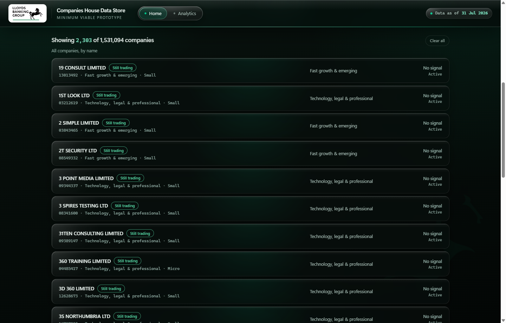

Each row gives you four things: the company name with its lifecycle chip, the company number and sector
and size underneath, the sector again in the middle column, and on the right whatever the current view
cares about.

That right-hand column changes with the view, which catches people out. In All companies it shows the
Gazette signal state. In Gazette signal it shows the distress stage and the date of the last notice. In
Former LBG client it shows how many competitor lenders they have now and when our charge was satisfied.
The list is showing you the thing you asked about.

You get 25 rows at a time, and there is a **Show more** button at the foot of the list that tells you
how many are left behind it: `Show more · 1,531,069 remaining`. It does not load on scroll, so a long
list will not run away with you. Clicking anywhere on a row opens that company.

---

## Inside a company profile

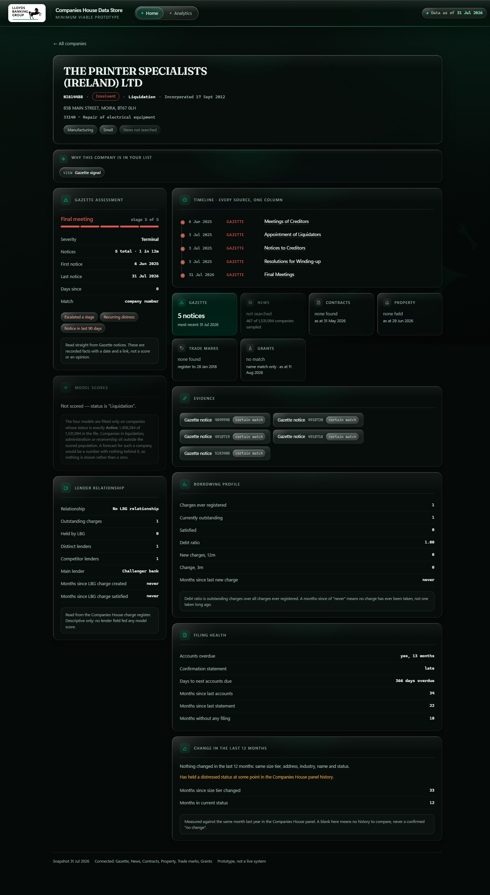

The header gives you identity: name, company number, lifecycle chip, registered status, incorporation
date, address, SIC code, and chips for sector and size.

### What the chips mean

Small labels turn up all over the profile and they are not decoration. There are three families and
they mean quite different things.

**On the header.** The first chip is lifecycle (*Still trading*, *Insolvent*, *Fading*, *Distressed*),
then sector and size. The last one is easy to misread: **News not searched** is a statement about our
coverage, not about the company. It means this company was not one of the 467 we searched. It is never
a claim that the company has had no press.

**On the Gazette panel.** These describe the *pattern* of notices rather than any single one, and they
are the ones worth acting on:

| Chip | What it is saying |
|---|---|
| Escalated a stage | They have moved further down the distress ladder, not just repeated a step |
| Recurring distress | More than one episode, rather than a single event |
| Notice in last 90 days | This is live, not history |

**On the Evidence panel.** Every Gazette notice is listed with a **certain match** chip and a link
straight to the notice on the Gazette. That panel is the audit trail: it exists so that nothing on the
page has to be taken on trust. If a profile claims five notices, the Evidence panel is where you go to
read all five. "Certain match" means the notice was matched on company number rather than by name.

A related label appears on Grants, which is matched on **name and postcode area** rather than company
number, so it carries a confidence and says "name match only" on the tile. Treat those as strong hints
rather than facts, which is exactly how the dashboard presents them.

### Why this company is in your list


If you arrived from a filtered list, this bar tells you which view, preset and filters put the company
in front of you. It is easy to lose track after a few clicks, and this is the answer to "hang on, why
am I looking at this one?".

### The model scores

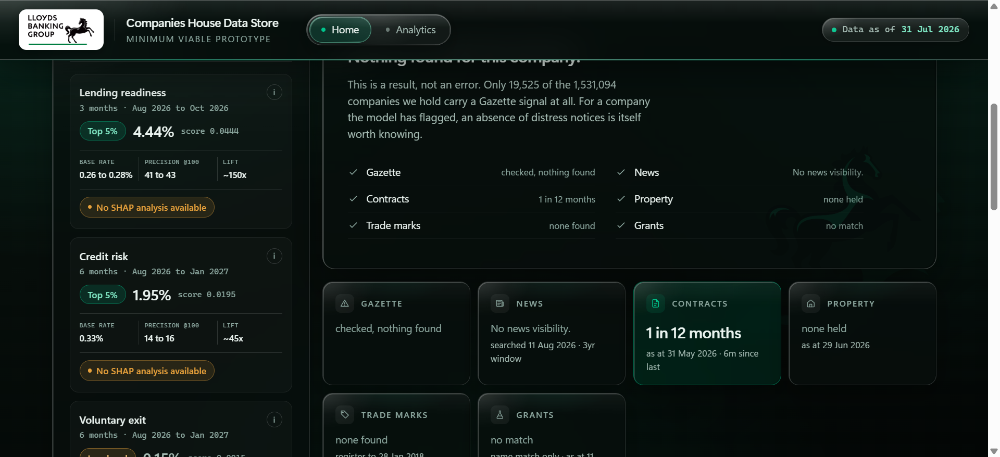

Four models, each predicting a different event over a different window, each in its own tile.

| Score | Window | What it predicts | Of the top 100 | Base rate | Lift |
|---|---|---|---|---|---|
| Lending readiness | 3 months | Takes on new secured borrowing | 41 to 43 | 0.26 to 0.28% | ~150x |
| Credit risk | 6 months | Hits a genuine insolvency event | 14 to 16 | 0.33% | ~45x |
| Voluntary exit | 6 months | Has a strike-off proposal filed | 78 to 85 | 7.22 to 8.24% | ~10x |
| Growth | 12 months | Moves up a size tier | 22 | 2.12 to 2.15% | ~10x |

**Read those three figures together.** Precision alone flatters voluntary exit: 78 to 85 in 100 sounds
extraordinary until you see that its base rate is already about 8%, so the lift is 10x, the same as
growth. Lending's 41 to 43 in 100 against a base rate of a quarter of a percent is the one that is
genuinely remarkable.

**All three describe the top 100 companies on that model, not the company you are looking at.** The
label says `@100` for that reason. A company sitting in the lower half of the lending list is nowhere
near 41 in 100; its true figure is close to the base rate.

They are given as a **range across two held-out months**, not the better of the two. Quoting the
flattering month is easy to do and hard to defend.

**The score itself is a percentage.** It is the model's estimated chance of the event inside its
window, corrected back to the true base rate after training. No calibration curve was fitted, so it
tracks well through the middle of the range and cannot be checked at the very top, where too few past
cases exist. Read the band rather than the digits when you are near the top of a list. The **Read
more** button under the panel carries the evidence.

**Band colour means position, and nothing else.** Mint for the top 5%, neutral for the top 10 to 25%,
amber below that. Amber is not a warning: it means this model does not single the company out, which
for credit risk and voluntary exit is good news.

**Voluntary exit is deliberately not ranked.** 998 of the top 1,000 scores are exact ties and the
top-100 cutoff alone is shared by 138 companies, so a ranking built on it would be arbitrary.

**Scores only exist for companies whose status is exactly Active**, 1,409,284 of the 1,531,094. For the
other 121,810 the panel does not show zeros, it disappears and says why.

#### SHAP analysis: what drives this score

Each tile can show the three features that moved that company's score, with the **value the model
actually saw** and a bar for each one's weight.

The value leads rather than the feature name, and that is deliberate. On lending the top feature is
"charges ever registered" for **every single one** of the 5,000 companies in the extract, so the name
tells you nothing; "578 charges" against "3 charges" is the whole of the difference between two
companies. An arrow shows whether the feature pushed the score up or pulled it down.

Weights are each contribution as a share of **that company's own three**, not a share of the score. The
raw log-odds sit behind the tile's `(i)` for anyone who wants them, and they must never be added up
against the score.

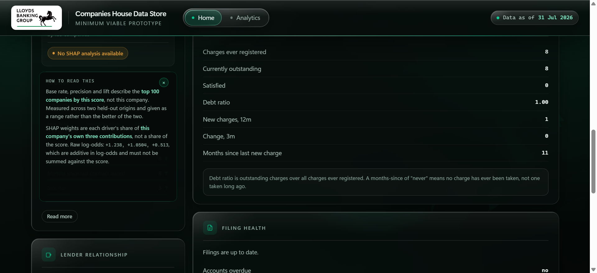

**Where a tile says "No SHAP analysis available"**, that is a gap in our coverage and not a statement
about the company. Reasons were computed for the top 5,000 companies **per model**, about 0.35% of
those scored, so most company pages will show it on most tiles. A company can be in one model's extract
and not another's.

### The six sources

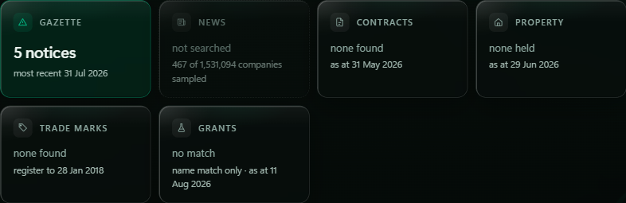

Six tiles, one per source, and the state of each tile is information in itself. There are three states
and the difference between the second and third matters:

- **Green with a figure.** We looked and found something. Click it to open the detail.
- **Plain, "none found" with a date.** We looked, on that date, and there was nothing. This is a
  finding, not a gap.
- **Dashed and dimmed, "not searched".** We did not look at this company. Absence here means nothing
  at all.

The dates on the tiles are not decoration. Contracts is as at 31 May 2026, Property as at 29 Jun 2026,
the Trade marks register runs to 28 Jan 2018, Grants as at 11 Aug 2026. A source can only tell you
about the period it covers.

**Gazette** is insolvency notices, matched on company number, so a hit is certain rather than probable.
Where a company has notices you get a severity tier, a stage on a five-step distress ladder, the notice
count, first and last dates, and flags like escalated a stage, recurring distress, notice in the last
90 days.

**Contracts** is public sector awards. **Property** is Land Registry titles, matched on company number.
**Trade marks** is the IPO register, live and lapsed. **Grants** is UKRI research funding, matched on
name and postcode area rather than number, so it carries a confidence and says so.

**News deserves its own paragraph**, because the result looks like a bug and is not. Only **467** of the
1,531,094 companies were searched at all, and of those, **zero** produced coverage that survived
verification. Fifteen produced raw hits that were rejected on review, mostly common-word company names
matching unrelated stories. That is the finding: UK SMEs are essentially invisible in national news, and
a pipeline that refused to count unverified matches is the pipeline working. Do not read "not searched"
on a news tile as "no coverage".

### Timeline, lender and borrowing

The **timeline** puts every dated event from every source into one column in date order, so you can see
a contract win and a Gazette notice in relation to each other rather than in separate panels.

**Lender relationship** is the competitive picture: whether they are a current, former or never client,
how many charges we hold, how many distinct lenders they have, who the main lender is, and how many
months since our charge was created or satisfied.

**Borrowing profile** is the charge register itself: charges ever registered, currently outstanding,
satisfied, the debt ratio, and how long since the last new charge.

**Filing health** and **Change in the last 12 months** are the administrative signals. The change panel
is careful about blanks: it tells you how many of its checks have no twelve-month history to compare
against, because a blank there means "we cannot say", never "nothing changed".

---

## Model rankings

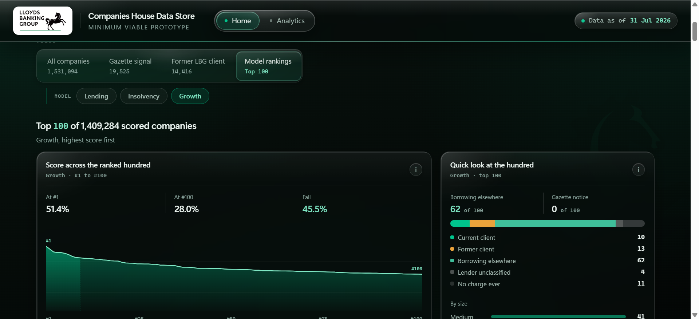

The fourth view answers a different question from the other three: not "which companies match these
conditions" but "who is at the top of this model". Selecting it reveals a second row of choices,
**Lending, Insolvency, Growth**, and the list becomes the top 100 companies on whichever you pick,
numbered #1 to #100.

**Voluntary exit is not offered here**, for the same reason it is not ranked on a company page: 138
companies share the rank-100 score, so positions 100 to 237 would be separated by nothing but an
arbitrary tie-break. On the other three, exactly one company holds the rank-100 score, so every
position from 1 to 100 is earned.

Above the list sit two cards that tell you what kind of hundred you are about to read.

**Score across the ranked hundred** is the shape of the fall from #1 to #100. It answers whether
position matters here: lending falls 38%, insolvency 64%, growth 45%, so in every case working the
list top-down is worth doing. A flat line would have told you the hundredth company was much like the
first. The chart is drawn against zero rather than against the range between #1 and #100, so the shape
you see is the real fall and not a stretched one, and the shaded band is the first ten.

It also carries the reason the ranking exists at all: **all 100 sit inside the top 1% of the 1,409,284
scored companies**, so the band on a company page says "Top 1%" for every one of them. Only a position
can separate them.

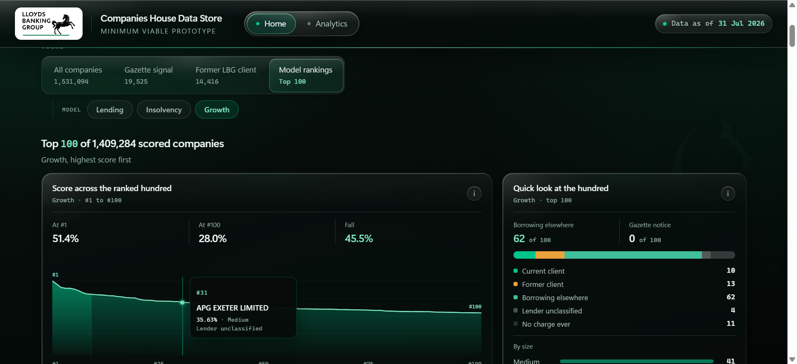

**Hover anywhere on the curve** and it names the company at that position: rank, score, size and who
already lends to them. Click and it opens that company's profile.

**Quick look at the hundred** is the composition, and it is the card that tells you which team the list
belongs to. Lending's hundred is 70% companies borrowing from someone else, which makes it a Growth
list. Insolvency's is 93% companies that have never registered a charge at all, which makes it not a
lending conversation. Underneath sits the size mix, and a line reporting how many of the hundred also
carry a Gazette notice.

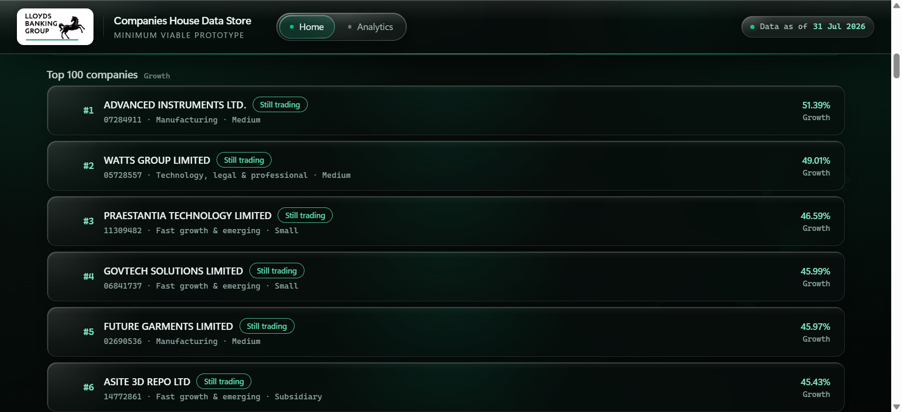

The cards below are the same cards as everywhere else, with the position in front of them, so clicking
one opens the profile exactly as it does from any other list.

One useful property: **every company in every top 100 has SHAP drivers on its profile**, because the
hundred sits inside the 5,000 for which reasons were computed. This is the one place in the dashboard
where you will never meet the empty driver state.

---

## The Analytics page

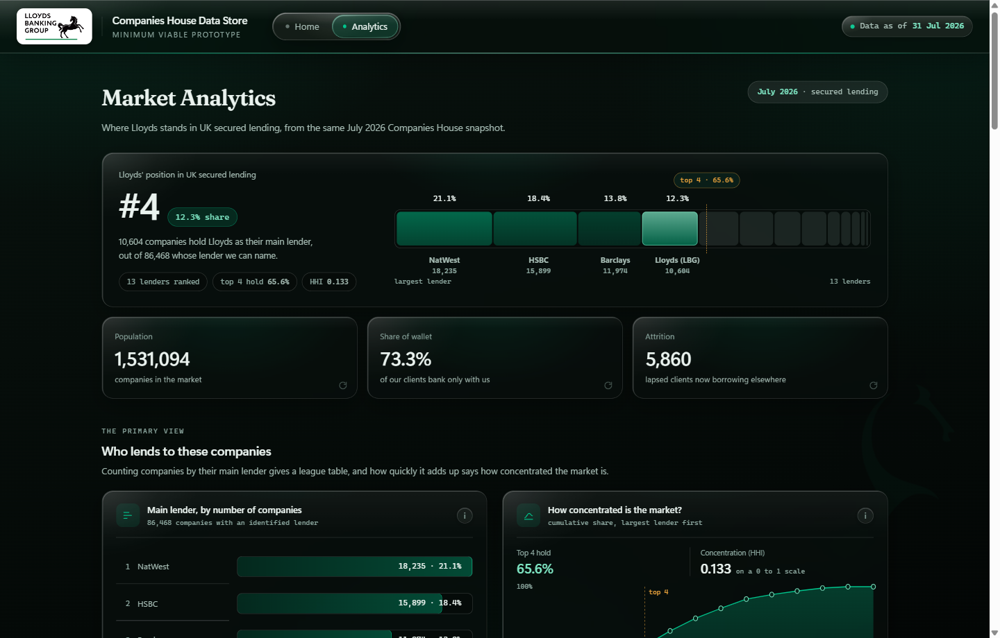

Home is about companies. Analytics is about the market, and it answers a different question: where does
Lloyds actually stand in UK secured lending?

The band at the top is the headline. **Lloyds is fourth with 12.3%** of the companies whose lender can
be named from the charge register. That universe is 86,468 companies, not the full 1.5 million, and the
page says so, because only a small share of companies have a charge with an identifiable lender behind
it.

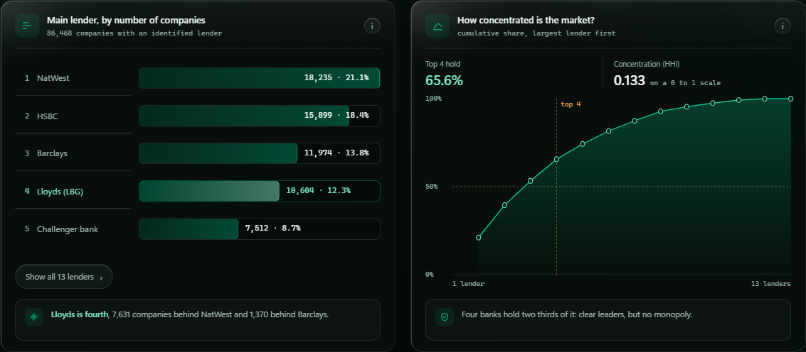

The league table and the concentration curve are the same finding read two ways. NatWest leads on
18,235 companies, then HSBC, then Barclays, then us on 10,604. The curve shows how fast the market adds
up: the **top four hold 65.6%**, with an HHI of 0.133. Clear leaders, no monopoly.

Below that, eleven figures in five movements. Knowing what is there saves you scrolling for it:

| Movement | Figures |
|---|---|
| The primary view | Main lender league table; how concentrated the market is |
| The market at a glance | Companies by sector; by size band; how old they are |
| Detail, by bank | Share of each sector's borrowers, as a heatmap |
| Our book | Share of a client's borrowing that is ours; how contested the book is; clients under pressure |
| Where clients went | Destination of lapsed clients now borrowing elsewhere; borrowing by sector and our share of it |

Two numbers from our book worth carrying around. Of 11,733 current clients, **73.3% borrow only from
us**. And of the 14,416 who have lapsed, **5,860 now borrow elsewhere while 8,556 have no live borrowing
at all**, which means most of them stopped rather than switched. That distinction changes what you would
do about it.

Every card has a small **i** button that opens a plain-English note on how to read that chart, and the
three KPI cards at the top flip over when you click them to show the same thing. Charts with more than
five rows show the top five and keep the rest behind a **Show all** button. The age histogram tags each
bar on hover, so you can ask what a spike is.

Two things to know about this page. Nothing on it is recalculated in the browser, and **none of it
responds to the filters on Home**. It always describes the whole market, so you cannot filter Analytics
down to a segment. If you want to know about a slice, that is a Home question.

---

## Things to try

Work down this table and you will have used every part of the dashboard at least once.

| Try this | Where to go | What it shows you |
|---|---|---|
| **Loosen a preset** | *Best prospects we don't bank*, then open Advanced filters and change Lending readiness from Top 1% to Top 10% | The list goes from **8,992 to 102,820**. Teaches you how presets and filters relate, and how much one band was holding back |
| **Find distress before it is public** | Compare the *Gazette signal* view against the *Silent distress* preset | 19,525 already in trouble, against 2,520 still trading with both filing signals failed and nothing filed yet |
| **See a zero that is an answer** | Apply *Silent distress* while the *Gazette signal* view is selected | Returns **0**, correctly. The two are opposites by construction |
| **Watch several sources fire at once** | `01088345` ANTALIS LIMITED | Property, trade marks and contracts all lit on one profile |
| **Read the working capital story** | `08664789` CONSTELLIA PUBLIC LTD | 64 public contracts in twelve months, never registered a charge |
| **Look at a genuine prospect** | `12723324` MS LENDING GROUP LIMITED | Top 1% lending readiness, never an LBG client |
| **Reach the end of the distress ladder** | `06624900` BNN TECHNOLOGY PLC | Terminal severity, five notices, and we hold security |
| **Check the audit trail** | Any Gazette company, then the Evidence panel | Every notice listed with a certain-match chip and a link to the notice itself |
| **Build a question the presets miss** | Former LBG client view, add *Competitor charge created (6m)*, add Manufacturing | **230 companies**: manufacturers who left us and whom a rival has just lent to |
| **Step back from companies entirely** | The Analytics page | Where Lloyds actually sits: fourth, 12.3%, in a market where the top four hold 65.6% |

One to try last, because it is the one most likely to mislead you. Open `02634371`
(**UNION PENSION TRUSTEES LIMITED**) and you will see ten rival lenders and 225 outstanding LBG charges.
Before reading anything into that, it is a trustee company: the register is recording custody on behalf
of clients, not a trading balance sheet. The same caveat applies at the extreme end of the property
data. It is a useful reminder that the register sometimes describes a legal arrangement rather than a
business, and that the dashboard reports what the register says rather than interpreting it for you.

---

## Reading the numbers honestly

Three habits will keep you out of trouble when using the dashboard.

**Check what the right-hand column is showing you**, because it changes with the view and it is easy to
read a distress stage as though it were a signal state.

**Treat "not searched" and "none found" as different things.** One is an absence of evidence, the other
is evidence of absence, and the tiles are careful to distinguish them even when the distinction is
inconvenient.

**Take the band, not the score.** Every model panel tells you the measured hit rate for companies at
that level, and that number is the honest read. 43 in 100 is a good signal. It is not a certainty, and
the panel would rather say so than round it up for you.
